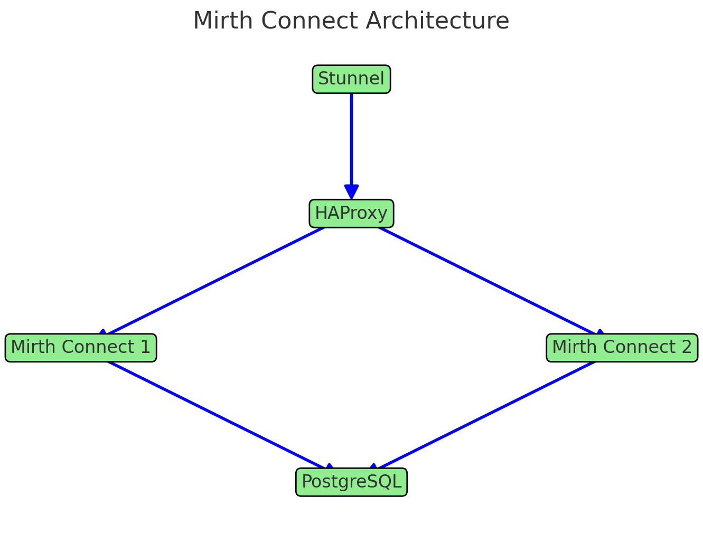

# Mirth Connect Deployment Architecture

This setup involves two Mirth Connect instances behind HAProxy and Stunnel, connected to a PostgreSQL database. The architecture diagram below illustrates the flow:

## Components

- **Stunnel**: Handles secure tunneling.
- **HAProxy**: Distributes traffic to the Mirth Connect instances.
- **Mirth Connect Instances**:
  - Mirth Connect 1
  - Mirth Connect 2
- **PostgreSQL**: Database backend for both Mirth Connect instances.
  - The postgres has 2 databases and schemas in it. One for each Mirth Connect. Please see startup_files/postgres-init/mc-postgres-init.sql
  - If heavy load you can break this up and drop stunnel in front of each docker-compose
  - Also if you need to the postgres+citus database is set to master so you can add more nodes.

## Flow

1. Incoming traffic reaches **Stunnel** for secure tunneling.
2. Traffic is routed to **HAProxy** for load balancing.
3. **HAProxy** directs requests to one of the Mirth Connect instances.
4. Each Mirth Connect instance communicates with the shared **PostgreSQL** database.
5. If data basee starts to become overloaded we can set it to a cluster with citus.

Use at your own risk, You download and run it it's your issue is something breaks.
Don't cry to me. You were warned.

Ok - I'll fill all this in with directions later.

Right now it allows connections without needing a client cert. I wanted this example out in case anyone else has this same idea.

This will allow any connection over sll to the STUNNEL.

I will fill this out in a bit and give instructions on how to use it.

Open external ports:

PGAdmin, STUNNEL, Mirth connects on 8443 and 8444.
haproxy is balancing the load.
1 postgres for both connects but seperate database and schemas

ok I am tired...

## License

@copywright In-Game event, A Red Flag Syndicate LLC

This program is distributed in the hope that it will be useful,

This program is licensed under the **Server Side Public License (SSPL), Version 1**, with additional terms as outlined below:

- **Commercial Use**:
  - Any use of this software in a commercial capacity, including offering it as part of a managed service or SaaS product, requires a commercial license agreement with **In-Game Event, A Red Flag Syndicate LLC**.
  - To obtain a commercial license, contact: [licence_request@igearfs.com](mailto:licence_request@igearfs.com).

- **Non-Commercial Use**:
  - If you choose not to obtain a commercial license, you must comply with the SSPL terms. This includes making publicly available the source code for all programs, tooling, and infrastructure used to operate this software as a service.

---

## No Warranty

This program is distributed in the hope that it will be useful, but WITHOUT ANY WARRANTY; without even the implied warranty of MERCHANTABILITY or FITNESS FOR A PARTICULAR PURPOSE.

For licensing inquiries, contact:
- **License Requests**: [licence_request@igearfs.com](mailto:licence_request@igearfs.com)
- **General Inquiries**: [contact@igearfs.com](mailto:contact@igearfs.com)

For more details, refer to the full text of the **Server Side Public License (SSPL)** at [https://www.mongodb.com/licensing/server-side-public-license](https://www.mongodb.com/licensing/server-side-public-license).

